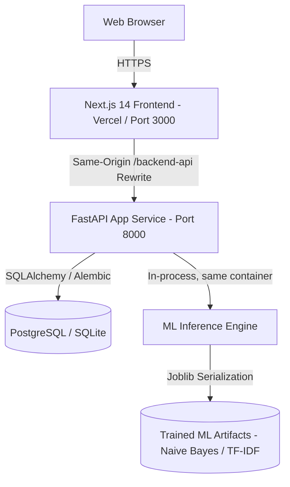

# ScamGuard — AI-Powered Online Scam & Fraud Detection System

ScamGuard is a full-stack, production-grade cybersecurity intelligence platform designed to detect phishing attacks, lottery fraud, UPI/banking scams, and social engineering in real time using Machine Learning and Explainable AI (XAI).

---

## 🌐 Deployment status

This repository has previously been connected to Vercel (frontend) and Render (backend), with URLs referenced in earlier project history. **This document does not claim those deployments are currently live or up to date with this code** — no deployment was performed or re-verified as part of producing this codebase, and no URL here should be treated as a working, current link. To confirm whether a live instance exists and matches this code, check your own Vercel/Render dashboards directly.

Per `render.yaml`, only a single backend service (`app_service`) is defined for cloud deployment — there is **no separate `ml_service` deployed to Render**; ML inference runs in-process inside `app_service` in that configuration (see Architecture below). A standalone `ml_service` container is only part of the local/self-hosted `docker-compose` setup.

---

## 🎯 Key Capabilities & Production Features

- **Real-Time Detection**: Classifies messages as legitimate or scam with high-confidence probability scores using scikit-learn models (Naive Bayes & TF-IDF).
- **Explainable AI (XAI)**: Identifies top contributing tokens/keywords, threat scores, risk dimensions (urgency, financial risk, credential theft, etc.), and suggested next steps.
- **Multi-Channel Scanners**: Supports raw text, URLs, emails (.eml/text), screenshot/image OCR, document PDFs, and QR codes.
- **Live Camera / Optical Scanner**: In-browser device camera viewfinder for real-time capture of printed phishing letters, SMS on secondary phones, or physical QR codes.
- **Enterprise Authentication**: Secure user registration, login, JWT access/refresh token rotation, bcrypt password hashing, and Role-Based Access Control (RBAC).
- **Comprehensive Settings Suite**:
  - **Profile Management**: Update display name, view role, and switch themes.
  - **Account Security**: Change password with live strength validation (8+ chars, uppercase, digit) and show/hide toggles.
  - **Detection Preferences**: Auto-save toggles, default input channels, and visual warning alerts.
  - **Privacy & Data Controls**: One-click JSON data export (GDPR-compliant) and irreversible history purging.
  - **Danger Zone**: Secure account deletion requiring strict typed confirmation (DELETE).
- **Scan History & Analytics**: Filterable history, CSV report generation, accuracy feedback loops, and live statistical distribution charts.
- **System Administration**: Live cluster telemetry from PostgreSQL, verified user directory, and threat volume tracking.

---

## 🏗️ System Architecture



> **Note on the deployed topology:** the codebase supports running ML
> inference as a separate `ml_service` container (see `infra/docker-compose.yml`
> and `backend/docs/ML_SERVICE.md` for the multi-service local/self-hosted setup, useful
> for independently scaling inference). The **current Render deployment
> (`render.yaml`) only provisions the single `app_service` container**, which
> loads the model in-process — there is no separate ML microservice running in
> production today. This is a deliberate simplification (one fewer moving part,
> one fewer cold start) rather than an oversight; the app_service code still
> checks for a remote ML service first for forward-compatibility, but always
> falls through to serving the real trained model in-process on the current
> deployment.

---

## ⚙️ Environment variables

All backend configuration is via `backend/.env` (copy from `backend/.env.example`). Every variable actually used by the app:

| Variable | Purpose | Required? |
|---|---|---|
| `SECRET_KEY` | JWT signing secret. **Refuses to start if left at the known placeholder value while `DEBUG=false`** -- generate a real one for anything beyond local dev. | Yes |
| `DEBUG` | Defaults to `false`. Set `true` only for local development. | No |
| `DATABASE_URL` | Postgres (production) or SQLite (local fallback) connection string. | Yes |
| `ML_SERVICE_URL` | URL of a separate `ml_service` container, if running one (self-hosted `docker-compose` setup only -- **not used by the current Render deployment**, which runs ML in-process). | No |
| `CORS_ORIGINS` | Comma-separated allowed frontend origins. | Yes |
| `ACCESS_TOKEN_EXPIRE_MINUTES` / `REFRESH_TOKEN_EXPIRE_DAYS` | JWT lifetimes. | No |
| `RATE_LIMIT_DEFAULT` / `RATE_LIMIT_AUTH` | SlowAPI rate limits. | No |
| `VOICE_TRANSCRIPTION_PROVIDER` / `VOICE_TRANSCRIPTION_API_KEY` | Optional server-side audio transcription provider. Unset by default -- browser-based live transcription (Web Speech API) works regardless; only server-side audio-*file* transcription needs this. | No |
| `COPILOT_LLM_PROVIDER` / `COPILOT_LLM_API_KEY` | Optional external LLM for Copilot. Unset by default -- Copilot answers via the deterministic, evidence-grounded engine instead. | No |

The frontend needs no `.env` for local dev beyond what Next.js generates (`frontend/.env.local`) for its own tooling; the API base URL is proxied same-origin via `next.config.js` rewrites, not an environment variable.

---

## 🚀 Getting Started

### Prerequisites
- **Node.js**: v18+ or v20+ LTS
- **Python**: v3.10, v3.11, or v3.12
- **Docker & Docker Compose**: Optional (recommended for one-command containerized run)

---

### Option A: One-Command Startup with Docker Compose (Recommended)

From the project root directory, run:

```bash
docker compose up --build
```

This starts all services together:
- **Web UI**: [http://localhost:3000](http://localhost:3000) (or via Nginx on port 80)
- **Backend API**: [http://localhost:8000](http://localhost:8000)
- **API Docs (Swagger)**: [http://localhost:8000/docs](http://localhost:8000/docs)
- **ML Service**: [http://localhost:8002](http://localhost:8002)
- **PostgreSQL**: localhost:5432

---

### Option B: Local Setup Without Docker (VS Code / Terminal)

Open **three terminal windows** in your IDE/command prompt:

#### Terminal 1 — Backend App Service
```bash
cd backend
python -m venv venv
# Windows:
venv\Scripts\activate
# macOS/Linux:
# source venv/bin/activate

pip install -r requirements.txt
# Starts on http://localhost:8000 (uses local SQLite database automatically if PostgreSQL is not set)
uvicorn app_service.main:app --port 8000 --reload
```

#### Terminal 2 — ML Inference Service
```bash
cd backend
# Windows:
venv\Scripts\activate
# macOS/Linux:
# source venv/bin/activate

pip install -r requirements-ml.txt
# Starts on http://localhost:8002 (uses pre-trained models bundled in backend/artifacts)
uvicorn ml_service.main:app --port 8002 --reload
```

#### Terminal 3 — Frontend UI
```bash
cd frontend
npm install
npm run dev
```
Open **[http://localhost:3000](http://localhost:3000)** in your browser.

---

## 🧪 Testing and Verification

The project includes an automated test suite with **509 unit and integration tests**, all passing as of the last verified run.

Run all tests:
```bash
cd backend
python -m pytest tests -v
python -m pytest ml_service/tests -v
python -m pytest ml_common/tests ml_training/tests -v
```

---

## 📁 Repository Structure

```
ScamGuard-AI/
├── docker-compose.yml          # Root one-command multi-container setup
├── backend/
│   ├── app_service/            # Core business logic, auth, REST API routes
│   │   ├── api/v1/             # Endpoints: auth, messages, users, health
│   │   ├── core/               # Config, JWT security, exceptions, rate-limiting
│   │   ├── db/                 # Models, database session, SQLite/PostgreSQL
│   │   └── services/           # Business logic & extraction service
│   ├── ml_service/             # Dedicated ML inference microservice
│   ├── ml_training/            # ML model training scripts & datasets
│   ├── ml_common/              # Shared NLP tokenizers, TF-IDF vectorizers
│   ├── artifacts/              # Bundled trained ML model weights & metadata
│   ├── requirements.txt        # App service dependencies
│   └── requirements-ml.txt     # ML service dependencies
├── frontend/                   # Next.js 14 React frontend with Tailwind CSS
│   ├── src/app/                # App router: login, register, dashboard, analyze, settings
│   ├── src/components/         # Reusable UI widgets, badges, verdict cards, camera scanner
│   └── src/lib/api/            # Typed API client with auto token refresh
├── infra/
│   └── docker/                 # Dockerfiles for each microservice
└── docs/                       # Architecture documentation and specs
```

---

## 🔒 Security Best Practices

- Passwords hashed using bcrypt.
- JWT access tokens with short expiry (15m) + secure refresh token rotation (7d).
- Strict Content Security Policy (CSP) & CORS configuration.
- Rate-limiting enabled via SlowAPI on sensitive auth & prediction routes.
- Privacy-first in-memory vectorization: message content is never sold or used for model retraining without consent.
- **URL analysis is SSRF-hardened**: every hostname the server actually connects to (including redirect targets, checked via an httpx request-level hook) is resolved and rejected if it's a loopback, private, link-local, multicast, or reserved address -- so a submitted URL can't be used to make the server fetch its own internal network or cloud metadata endpoint (`169.254.169.254`). TLS certificate verification is enforced (previously disabled).
- **File uploads (image/PDF/QR/email) are capped at 8 MB** server-side, independent of any reverse proxy in front of the service, to prevent memory exhaustion during OCR/PDF parsing.
- **No fabricated ML fallback**: if neither the remote ML microservice nor the in-process model can produce a real prediction, the API returns a `503 MODEL_UNAVAILABLE` error. There is no keyword-heuristic tier that manufactures a plausible-looking probability, confidence score, or model name when the real model is unavailable.

### Known limitations / not yet implemented

The codebase does not currently include: a real third-party CAPTCHA integration (self-hosted only, see below), live SPF/DKIM/DMARC re-verification (email auth status is parsed from the message's own `Authentication-Results` header only, never independently verified via DNS), an LLM-backed Copilot (deterministic evidence-grounded answers only -- see below), TLS certificate reuse for URL scans (a second, separate TLS handshake is made to read cert metadata), Redis/shared-state for CAPTCHA or login-attempt tracking (in-process only, single-instance), and case-level Copilot (Copilot answers about a single scan, not an aggregated case). These are documented gaps, not silently-broken features.

### Feature summary (what's actually implemented and tested)

- **Multimodal scanning**: text, URL, email, image/OCR, PDF, QR, live camera, and voice (browser Web Speech API for live transcription; server-side audio-file transcription is a pluggable, currently-unconfigured provider interface -- see `app_service/services/voice_transcription.py`)
- **English/Hindi/Hinglish preprocessing**: real Indian scam-concept detection (OTP, UPI, KYC, bank, etc.) across scripts, plus a documented heuristic (not ML-based) language detector (`ml_common/preprocessing/multilingual.py`)
- **Investigation/Case mode**: user-isolated cases linking real scans, a real action-driven timeline, entity aggregation from real linked-scan data (`app_service/services/case_service.py`)
- **Exportable reports**: JSON/CSV/PDF for both individual scans and cases, all built from one shared, real data source so formats can't drift out of sync (`app_service/services/report_builder.py`)
- **Demo Mode**: 6 representative examples run through the exact real pipeline (never persisted to real history) -- see `app_service/services/demo_service.py`
- **Admin Model Evaluation**: real accuracy/precision/recall/F1/confusion-matrix/dataset-size, read from the actual model registry, with an honest small-dataset limitation note
- **Robustness testing**: real base messages + 7 controlled text transforms (case, whitespace, punctuation, spelling, symbol insertion, homoglyph domains, URL obfuscation) run through the real pipeline, admin-only, never tuned to flatter the model
- **ScamGuard Copilot**: 5 question types answered by reading directly from a scan's own real evidence fields -- no free-text generation, no LLM configured by default (`app_service/services/copilot_service.py`)
- **Correlation**: recurring domains/entities/brands/categories detected against the *same user's own* past scans only -- never external threat intelligence

### CAPTCHA / abuse protection (added)

Registration and step-up login protection now use a real, self-hosted, stateless CAPTCHA (`app_service/core/captcha.py`, 11 tests): a short arithmetic challenge with an HMAC-SHA256-signed, time-limited token -- no server-side storage needed, tamper-evident, timing-safe verification. This is honestly scoped as a lightweight bot-friction mechanism, not a claim of parity with a third-party CAPTCHA service (reCAPTCHA/hCaptcha/Turnstile), which would need external account credentials this environment doesn't have; swapping one in later only requires changing the verification call site.

- **Registration**: always requires a solved CAPTCHA.
- **Login**: only requires one after 3 failed attempts for that email within 15 minutes (`app_service/core/login_attempts.py`) -- not on every normal login. That tracker is in-process (documented limitation: resets on restart, not shared across multiple app_service replicas; a multi-instance deployment would need to move it to Redis or the database).

### URL intelligence (added)

URL analysis now computes real, deterministic signals from the URL string itself (`ml_common/security/url_intelligence.py`, 20+ tests): punycode/IDN detection, IP-literal hosts, known URL shorteners, a short list of TLDs commonly abused in phishing campaigns, userinfo-obfuscation (`user@host` tricks), and lookalike/brand-impersonation detection via edit distance against a small explicit brand list. This is a best-effort heuristic layer, not a full public-suffix-list implementation or a live reputation/WHOIS/TLS lookup -- it does not claim domain age, certificate details, or a definitive verdict, only what's structurally observable in the URL text. TLS certificate metadata (subject/issuer/expiry) is best-effort and untested against a live host from this project's own dev environment. Results are surfaced as "Observed URL signals," kept explicitly separate from the model's own interpretation.

### Model evaluation (extended)

`ModelEvaluator` (`ml_training/evaluation/evaluator.py`) computes real accuracy/precision/recall/F1/ROC-AUC/false-positive-rate via scikit-learn on an actual train/test split, plus the raw confusion matrix counts (TP/TN/FP/FN). No metric here is invented; numbers reflect whatever the currently-trained model actually scores on its evaluation split. **The production model is trained on a genuinely small sample dataset (24 rows total)** -- the admin Model Evaluation view surfaces this explicitly rather than presenting the metrics as production-scale benchmarks.

---

## 👤 Author & Project Maintainer

- **Project Lead & Author**: **Prerana P Jois** ([@PreranaPJois-123](https://github.com/PreranaPJois-123))
- **Repository**: [https://github.com/PreranaPJois-123/ScamGuard-AI](https://github.com/PreranaPJois-123/ScamGuard-AI)
- **Project**: ScamGuard AI — AI-Powered Online Scam & Fraud Detection System
