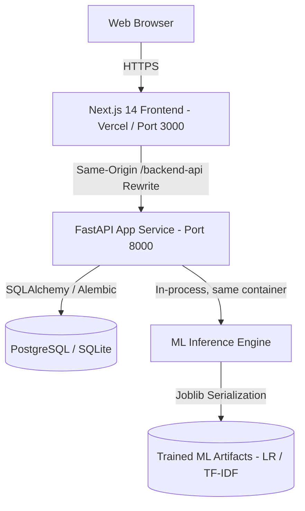

# ScamGuard — AI-Powered Online Scam & Fraud Detection System

ScamGuard is a full-stack, production-grade cybersecurity intelligence platform designed to detect phishing attacks, lottery fraud, UPI/banking scams, and social engineering in real time using Machine Learning and Explainable AI (XAI).

---

## 🌐 Live demo

**https://scamguard-ai-zeta.vercel.app** — use **"Try the demo account"** on the sign-in page, or paste a message into the quick check on the home page (no account needed).

Hosted for free: the Next.js frontend on **Vercel**, the FastAPI backend (with the model running in-process) on **Render**, and PostgreSQL on **Neon**. The backend keeps itself awake 24/7 (`app_service/services/keep_alive.py`).

---

## 🎯 What ScamGuard does

**Check anything** — SMS/WhatsApp text, links, emails, screenshots (WhatsApp chat-aware OCR, dark mode supported), PDFs, QR codes and voice calls (live captions or private on-device Whisper transcription, Hindi→English).

**Explain the verdict**
- **TrustLens** — for every result: the classifier probability and the final risk score side by side, a Scam Journey Mapper (only stages with matched phrases are marked), evidence for and against, evidence-based safety actions, a similar known pattern with its source (only when the retrieval evaluator accepts it) and an honest "why this may be wrong" section. It also shows **how a genuine message differs**, tactic by tactic, with a real example format. It adds no score of its own; see `docs/TRUSTLENS.md`.
- **Scam X-Ray** — highlights the exact trap phrases in the message and maps them onto the four stages of a scam: hook, pressure, the ask, cash-out.
- **Scam likelihood** — a logistic-regression model on word + character TF-IDF (v4, trained on ScamGuard-IN-2026, an audited corpus of real Indian SMS plus labelled synthetic messages) fused with an intent-based risk engine; the model's own probability is always shown alongside. On 1,874 real held-out Indian SMS from unseen scam campaigns the final verdict scores 97.1% accuracy with a 3.2% false-alarm rate (see `backend/ml_training/datasets/scamguard_in_2026/DATASHEET.md` and `backend/ml_training/research/results.md`).
- **Website trust score** — domain age from RDAP, HTTPS, link signals and a live inspection of the page (password/OTP/card forms, forms posting elsewhere, brand impersonation).
- **Ask ScamGuard** — answers "is this a scam?", "I already paid, what now?", "how do I report it?" (English/Hindi), backed by Gemini (or Groq/Anthropic/OpenAI) via env vars, with per-visitor and daily caps that fall back to built-in answers.

**Act on it**
- One-tap reporting to **Chakshu** (Sanchar Saathi) or **1930 / cybercrime.gov.in**, with a ready-to-paste complaint.
- **Community reports** for numbers, link domains, UPI IDs and emails (one vote per user; 2+ reports raise the score).
- **Golden Hour** — for people who already paid: a one-hour countdown, a direct call to 1930 and a complaint filled in from the scan.
- Share a warning on WhatsApp; export PDF/CSV/JSON reports.

**Learn and reach people**
- **ScamGuard Copilot** — a streaming chat that checks pasted messages, links and call transcripts with corrective retrieval over 42 Indian scam patterns and 10 genuine message formats, citing official sources.
- **Safety tools** — QR code payment check, "before you pay" UPI check, attachment/APK check and a **chat timeline** that scores every message of a pasted WhatsApp chat and marks the turning point where it moves from talk to a request.
- **Flashcards** — eight flip cards that show a new user how to use every part of ScamGuard, three steps each (`/flashcards`).
- **English/Hindi interface**, installable **PWA with Android share target**, and a **Chrome/Edge/Brave extension** (`browser-extension/`).

**Platform** — JWT auth with refresh rotation, bcrypt, self-hosted CAPTCHA, per-visitor rate limits, SSRF-safe URL fetching, CSP, admin model evaluation and robustness testing, 600+ automated tests.

---

## 🏗️ System Architecture


```mermaid
graph TD
    Client[Web Browser] -->|HTTPS| Frontend[Next.js 14 Frontend - Vercel / Port 3000]
    Frontend -->|Same-Origin /backend-api Rewrite| AppService[FastAPI App Service - Port 8000]
    AppService -->|SQLAlchemy / Alembic| DB[(PostgreSQL / SQLite)]
    AppService -->|In-process, same container| MLEngine[ML Inference Engine]
    MLEngine -->|Joblib Serialization| ModelRegistry[(Trained ML Artifacts - LR / TF-IDF)]
```

> **Note on the deployed topology:** the codebase supports running ML
> inference as a separate `ml_service` container (see `infra/docker-compose.yml`
> and `backend/docs/ML_SERVICE.md` for the multi-service local/self-hosted setup, useful
> for independently scaling inference). The **current Render deployment
> (`render.yaml`) runs the `app_service` container (`ScamGuard-AI`) plus the
> Next.js frontend (`scamguard-frontend`)**; the backend
> loads the model in-process — there is no separate ML microservice running in
> production today. This is a deliberate simplification (one fewer moving part,
> one fewer cold start) rather than an oversight; the app_service code still
> checks for a remote ML service first for forward-compatibility, but always
> falls through to serving the real trained model in-process on the current
> deployment.

---

## ⚙️ Environment variables

All backend configuration is via `backend/.env` (copy from `backend/.env.example`). Every variable actually used by the app:

| Variable | Purpose | Required? |
|---|---|---|
| `SECRET_KEY` | JWT signing secret. **Refuses to start if left at the known placeholder value while `DEBUG=false`** -- generate a real one for anything beyond local dev. | Yes |
| `DEBUG` | Defaults to `false`. Set `true` only for local development. | No |
| `DATABASE_URL` | Postgres (production) or SQLite (local fallback) connection string. | Yes |
| `ML_SERVICE_URL` | URL of a separate `ml_service` container, if running one (self-hosted `docker-compose` setup only -- **not used by the current Render deployment**, which runs ML in-process). | No |
| `CORS_ORIGINS` | Comma-separated allowed frontend origins. | Yes |
| `ACCESS_TOKEN_EXPIRE_MINUTES` / `REFRESH_TOKEN_EXPIRE_DAYS` | JWT lifetimes. | No |
| `RATE_LIMIT_DEFAULT` / `RATE_LIMIT_AUTH` | SlowAPI rate limits. | No |
| `VOICE_TRANSCRIPTION_PROVIDER` / `VOICE_TRANSCRIPTION_API_KEY` | Optional server-side audio transcription provider. Unset by default -- browser-based live transcription (Web Speech API) works regardless; only server-side audio-*file* transcription needs this. | No |
| `COPILOT_LLM_PROVIDER` / `COPILOT_LLM_API_KEY` | Optional external LLM for Copilot. Unset by default -- Copilot answers via the deterministic, evidence-grounded engine instead. | No |

The frontend needs no `.env` for local dev beyond what Next.js generates (`frontend/.env.local`) for its own tooling; the API base URL is proxied same-origin via `next.config.js` rewrites, not an environment variable.

---

## 🚀 Getting Started

### Prerequisites
- **Node.js**: v18+ or v20+ LTS
- **Python**: v3.10, v3.11, or v3.12
- **Docker & Docker Compose**: Optional (recommended for one-command containerized run)

---

### Run it locally (Windows, macOS, Linux)

**You need:** Python **3.10 to 3.14** and Node.js **18 or newer** (LTS). That's all: no database, no `.env` file, no Docker.

**In VS Code:** open the project folder, then **Terminal → Run Task… → "ScamGuard: Run (backend + frontend)"** (or press **Ctrl+Shift+B**).

**Or in any terminal**, from the project folder:

```bash
python run.py        # Windows (or: py run.py, or double-click start_all.bat)
python3 run.py       # macOS / Linux (or: ./start.sh)
```

The first run creates `backend/.venv`, installs the Python and npm packages and writes local config (about 2–5 minutes). Then it starts the backend on http://127.0.0.1:8000 and the frontend on http://localhost:3000, checks both answer, and opens the browser. Later runs start in seconds. **Ctrl+C stops both.** Logs are in `.run-logs/`.

It also stops an old ScamGuard server that was left running (the usual cause of "server busy / down" locally), and repairs settings from older setups. Problems? See **START_HERE.md → Troubleshooting**.

Other VS Code tasks: *Backend only*, *Install / repair setup*, *Backend tests*, *Frontend checks*. The Run and Debug panel has *Backend: FastAPI (debug)*, *Frontend: Next.js dev* and *Debug both*.

### Docker Compose (optional, full multi-service setup)

```bash
docker compose up --build
```

Starts PostgreSQL, the backend, the optional separate ML service and the frontend (see `backend/docs/ML_SERVICE.md`).

---

## 🧪 Testing and Verification

The project includes **820 backend tests** (pytest) and **14 frontend tests** (Vitest), verified on Python 3.10 to 3.14.

Run all tests:
```bash
cd backend
python -m pytest tests -v
python -m pytest ml_service/tests -v
python -m pytest ml_common/tests ml_training/tests -v
```

---

## 📁 Repository Structure

```
ScamGuard-AI/
├── docker-compose.yml          # Root one-command multi-container setup
├── backend/
│   ├── app_service/            # Core business logic, auth, REST API routes
│   │   ├── api/v1/             # Endpoints: auth, messages, users, health
│   │   ├── core/               # Config, JWT security, exceptions, rate-limiting
│   │   ├── db/                 # Models, database session, SQLite/PostgreSQL
│   │   └── services/           # Business logic & extraction service
│   ├── ml_service/             # Dedicated ML inference microservice
│   ├── ml_training/            # ML model training scripts & datasets
│   ├── ml_common/              # Shared NLP tokenizers, TF-IDF vectorizers
│   ├── artifacts/              # Bundled trained ML model weights & metadata
│   ├── requirements.txt        # App service dependencies
│   └── requirements-ml.txt     # ML service dependencies
├── frontend/                   # Next.js 14 React frontend with Tailwind CSS
│   ├── src/app/                # App router: login, register, dashboard, analyze, settings
│   ├── src/components/         # Reusable UI widgets, badges, verdict cards, camera scanner
│   └── src/lib/api/            # Typed API client with auto token refresh
├── infra/
│   └── docker/                 # Dockerfiles for each microservice
└── docs/                       # Architecture documentation and specs
```

---

## 🔒 Security Best Practices

- Passwords hashed using bcrypt.
- JWT access tokens with short expiry (15m) + secure refresh token rotation (7d).
- Strict Content Security Policy (CSP) & CORS configuration.
- Rate-limiting enabled via SlowAPI on sensitive auth & prediction routes.
- Privacy-first in-memory vectorization: message content is never sold or used for model retraining without consent.
- **URL analysis is SSRF-hardened**: every hostname the server actually connects to (including redirect targets, checked via an httpx request-level hook) is resolved and rejected if it's a loopback, private, link-local, multicast, or reserved address -- so a submitted URL can't be used to make the server fetch its own internal network or cloud metadata endpoint (`169.254.169.254`). TLS certificate verification is enforced (previously disabled).
- **File uploads (image/PDF/QR/email) are capped at 8 MB** server-side, independent of any reverse proxy in front of the service, to prevent memory exhaustion during OCR/PDF parsing.
- **No fabricated ML fallback**: if neither the remote ML microservice nor the in-process model can produce a real prediction, the API returns a `503 MODEL_UNAVAILABLE` error. There is no keyword-heuristic tier that manufactures a plausible-looking probability, confidence score, or model name when the real model is unavailable.

### Known limitations

- Scans happen when a user submits something; there is no automatic SMS or call interception (that would need a native Android app).
- Domain age depends on the public RDAP service; if it is unreachable the trust score says "registration date not available".
- The Indian scam supplement is curated by the team, not field-collected; accuracy is reported on separately written hold-out sets.
- No real third-party CAPTCHA, no independent SPF/DKIM/DMARC DNS verification, and CAPTCHA/login-attempt state is in-process (single instance).

### CAPTCHA / abuse protection (added)

Registration and step-up login protection now use a real, self-hosted, stateless CAPTCHA (`app_service/core/captcha.py`, 11 tests): a short arithmetic challenge with an HMAC-SHA256-signed, time-limited token -- no server-side storage needed, tamper-evident, timing-safe verification. This is honestly scoped as a lightweight bot-friction mechanism, not a claim of parity with a third-party CAPTCHA service (reCAPTCHA/hCaptcha/Turnstile), which would need external account credentials this environment doesn't have; swapping one in later only requires changing the verification call site.

- **Registration**: always requires a solved CAPTCHA.
- **Login**: only requires one after 3 failed attempts for that email within 15 minutes (`app_service/core/login_attempts.py`) -- not on every normal login. That tracker is in-process (documented limitation: resets on restart, not shared across multiple app_service replicas; a multi-instance deployment would need to move it to Redis or the database).

### URL intelligence (added)

URL analysis now computes real, deterministic signals from the URL string itself (`ml_common/security/url_intelligence.py`, 20+ tests): punycode/IDN detection, IP-literal hosts, known URL shorteners, a short list of TLDs commonly abused in phishing campaigns, userinfo-obfuscation (`user@host` tricks), and lookalike/brand-impersonation detection via edit distance against a small explicit brand list. This is a best-effort heuristic layer, not a full public-suffix-list implementation or a live reputation/WHOIS/TLS lookup -- it does not claim domain age, certificate details, or a definitive verdict, only what's structurally observable in the URL text. TLS certificate metadata (subject/issuer/expiry) is best-effort and untested against a live host from this project's own dev environment. Results are surfaced as "Observed URL signals," kept explicitly separate from the model's own interpretation.

### Model evaluation (extended)

`ModelEvaluator` (`ml_training/evaluation/evaluator.py`) computes real accuracy/precision/recall/F1/ROC-AUC/false-positive-rate via scikit-learn, plus the raw confusion matrix counts. The production model (`logistic_regression` v4) is trained on ScamGuard-IN-2026 (`backend/ml_training/datasets/scamguard_in_2026/`), split by scam campaign so no near-duplicate of a test message is seen in training. `python -m ml_training.research.run_experiments` reproduces every reported number; `results.md` holds the tables.

---

## 👤 Author & Project Team

- **Project Lead & Author**: **Priyam Thakur** (1BM23CS252) ([@priyamthakur275](https://github.com/priyamthakur275))
- **Team Members**: Bhavya Goyal (1BM23CS063), Samir Chaudhary (1BM23CS294), Sana Subodh (1BM23CS296)
- **Guide**: Dr. Kayarvizhy N, Professor, Department of CSE, B.M.S. College of Engineering, Bengaluru
- **Repository**: [https://github.com/priyamthakur275/ScamGuard-AI](https://github.com/priyamthakur275/ScamGuard-AI)
- **Project**: ScamGuard AI — AI-Powered Online Scam & Fraud Detection System (Major Project, B.E. Computer Science and Engineering)
